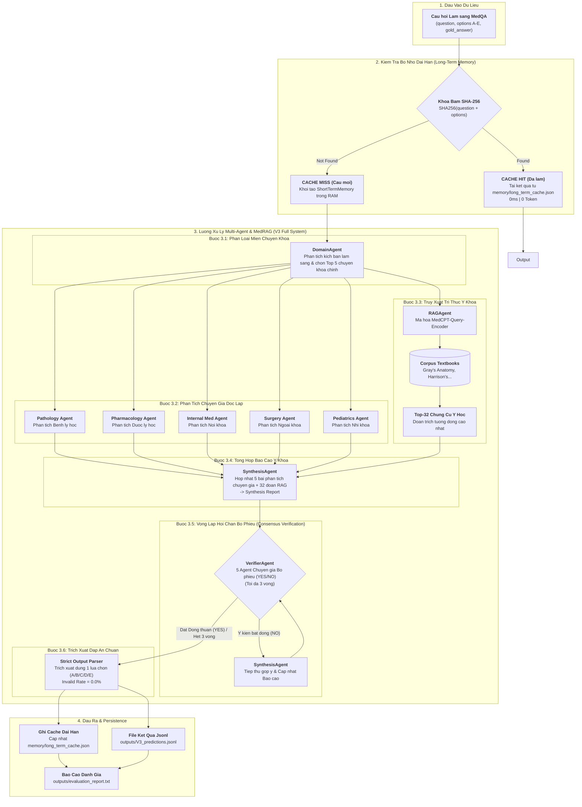

# MedRAGAgents: Medical Multi-Agent RAG System for MedQA-USMLE

MedRAGAgents là hệ thống Multi-Agent Y khoa hợp nhất được xây dựng cho Đề tài Giữa kỳ môn Machine Learning in Security (UIT-SDH). Hệ thống kết hợp lập luận đa Agent chuyên gia y khoa, truy xuất tri thức y khoa bổ trợ (MedRAG) và kiến trúc bộ nhớ hai tầng (Dual-Layer Memory) nhằm tối ưu hóa độ chính xác thực tế (factual accuracy) và giảm thiểu hiện tượng ảo giác (hallucination) trên bộ dữ liệu MedQA-USMLE.

---

## 1. Ý Tưởng Cốt Lõi và Đặt Vấn Đề (Project Motivation & Core Idea)

Trong thực hành lâm sàng, việc chẩn đoán các ca bệnh phức tạp (như trong bộ câu hỏi MedQA-USMLE) đòi hỏi sự phối hợp giữa nhiều chuyên khoa y học (Giải phẫu học, Dược lý học, Bệnh lý học, Nội khoa...). Các mô hình ngôn ngữ lớn (LLM) đơn lẻ thường gặp hạn chế ảo giác kiến thức hoặc tự tin đưa ra chẩn đoán sai khi thiếu sự tư vấn đa chuyên khoa và thiếu nguồn tài liệu tham khảo chính thống.

Hệ thống MedRAGAgents giải quyết các hạn chế trên thông qua 3 trụ cột thiết kế chính:

1. Phân rã đa chuyên khoa (Multi-Specialty Agent Decomposition):
   Thay vì gửi câu hỏi cho một mô hình duy nhất, kịch bản lâm sàng được phân loại thành các vùng tri thức y khoa chuyên sâu. Các Agent đại diện cho từng chuyên khoa sẽ phân tích độc lập câu hỏi theo đúng góc nhìn chuyên môn của họ.
2. Truy xuất chứng cứ y khoa (MedRAG Retrieval):
   Tri thức y khoa được truy xuất động từ csdl sách giáo khoa y khoa chuẩn (Textbooks corpus) thông qua mô hình nhúng MedCPT vector, giúp bổ sung chứng cứ lý thuyết chính xác cho các Agent lập luận.
3. Hội chẩn đồng thuận và Bộ nhớ hai tầng (Consensus Verification & Dual-Layer Memory):
   Một Verifier Agent đóng vai trò chủ trì luồng hội chẩn, điều phối các Agent chuyên khoa bỏ phiếu (YES/NO) và sửa đổi báo cáo tổng hợp cho đến khi đạt đồng thuận. Trạng thái trung gian được lưu trong Bộ nhớ ngắn hạn (Short-Term Memory), trong khi các dự đoán đã hoàn tất được lưu vào Bộ nhớ dài hạn (Long-Term Memory dạng SHA-256 cache) để tối ưu chi phí và độ trễ.

---

## 2. Cách Thức Hoạt Động của Hệ Thống (System Workflow)

### Sơ Đồ Quy Trình Hoạt Động Tổng Thể (Mermaid Architecture Diagram)



### Các Bước Xử Lý Chi Tiết

Luồng xử lý một câu hỏi lâm sàng trong hệ thống MedRAGAgents trải qua 5 bước chính:

1. Bước 1 - Phân loại vùng tri thức (`DomainAgent`):
   Hệ thống đọc câu hỏi lâm sàng và các phương án chọn, sau đó phân loại thành 5 chuyên khoa chính cho câu hỏi và 2 chuyên khoa liên quan cho phương án lựa chọn.
2. Bước 2 - Phân tích chuyên sâu từng miền (`AnalysisAgent`):
   Kích hoạt các Agent chuyên gia y khoa tương ứng để phân tích ca bệnh độc lập từ góc nhìn chuyên môn của từng ngành (ví dụ: góc nhìn Bệnh lý học, góc nhìn Dược lý học).
3. Bước 3 - Truy xuất chứng cứ y khoa (`RAGAgent`):
   Sử dụng bộ truy xuất MedCPT để tìm kiếm Top-32 đoạn văn bản chứng cứ có độ tương đồng cao nhất từ cơ sở dữ liệu y khoa Textbooks.
4. Bước 4 - Tổng hợp báo cáo y khoa (`SynthesisAgent`):
   Tổng hợp toàn bộ các báo cáo phân tích chuyên gia và dữ liệu RAG thu thập được thành một bản báo cáo phân tích y khoa hợp nhất (Synthesis Report).
5. Bước 5 - Hội chẩn bỏ phiếu & Sửa đổi (`VerifierAgent`):
   Các Agent chuyên khoa tiến hành đánh giá và bỏ phiếu đồng thuận (YES/NO) trên báo cáo hợp nhất. Nếu có ý kiến bất đồng (NO), Agent đưa ra đề xuất sửa đổi, báo cáo được cập nhật và bỏ phiếu lại (tối đa 3 vòng) trước khi trích xuất đáp án lựa chọn cuối cùng (A, B, C, D hoặc E).

### Các Bước Xử Lý Chi Tiết

Luồng xử lý một câu hỏi lâm sàng trong hệ thống MedRAGAgents trải qua 5 bước chính:

1. Bước 1 - Phân loại vùng tri thức (`DomainAgent`):
   Hệ thống đọc câu hỏi lâm sàng và các phương án chọn, sau đó phân loại thành 5 chuyên khoa chính cho câu hỏi và 2 chuyên khoa liên quan cho phương án lựa chọn.
2. Bước 2 - Phân tích chuyên sâu từng miền (`AnalysisAgent`):
   Kích hoạt các Agent chuyên gia y khoa tương ứng để phân tích ca bệnh độc lập từ góc nhìn chuyên môn của từng ngành (ví dụ: góc nhìn Bệnh lý học, góc nhìn Dược lý học).
3. Bước 3 - Truy xuất chứng cứ y khoa (`RAGAgent`):
   Sử dụng bộ truy xuất MedCPT để tìm kiếm Top-32 đoạn văn bản chứng cứ có độ tương đồng cao nhất từ cơ sở dữ liệu y khoa Textbooks.
4. Bước 4 - Tổng hợp báo cáo y khoa (`SynthesisAgent`):
   Tổng hợp toàn bộ các báo cáo phân tích chuyên gia và dữ liệu RAG thu thập được thành một bản báo cáo phân tích y khoa hợp nhất (Synthesis Report).
5. Bước 5 - Hội chẩn bỏ phiếu & Sửa đổi (`VerifierAgent`):
   Các Agent chuyên khoa tiến hành đánh giá và bỏ phiếu đồng thuận (YES/NO) trên báo cáo hợp nhất. Nếu có ý kiến bất đồng (NO), Agent đưa ra đề xuất sửa đổi, báo cáo được cập nhật và bỏ phiếu lại (tối đa 3 vòng) trước khi trích xuất đáp án lựa chọn cuối cùng (A, B, C, D hoặc E).

---

## 3. Cơ Chế Bộ Nhớ Hai Tầng (Dual-Layer Memory Mechanism)

### Bộ Nhớ Ngắn Hạn (`ShortTermMemory`)

- Scope: Tồn tại trong bộ nhớ RAM trong suốt lượt xử lý của 01 câu hỏi.
- Mục đích: Lưu trữ và truyền tải dữ liệu trung gian (danh sách chuyên khoa, bài phân tích từng miền, đoạn trích RAG, lịch sử bỏ phiếu) giữa các Agent.
- Vòng đời: Tự động reset sạch thông qua hàm `reset_short()` khi chuyển sang câu hỏi tiếp theo để tránh nhiễm độc ngữ cảnh.

### Bộ Nhớ Dài Hạn (`LongTermMemory`)

- Scope: Lưu trữ persistent dạng JSON trên đĩa tại `./memory/long_term_cache.json`.
- Cơ chế mã hóa: Tạo khóa băm SHA-256 từ chuỗi `question.strip() + str(options)`.
- Mục đích: Bỏ qua quá trình tính toán LLM đối với các câu hỏi đã từng suy luận trước đó (`from_cache=True`), đạt độ trễ 0ms và chi phí 0 token.

---

## 4. Ma Trận Đối Chiếu Yêu Cầu Đề Tài Giữa Kỳ (Compliance Matrix)

Hệ thống tuân thủ đầy đủ các yêu cầu trong Đề tài giữa kỳ môn Machine Learning in Security:

| Tiêu chí Yêu cầu | Quy định Đề tài Giữa kỳ                                                | Triển khai trong MedRAGAgents                                                            | File minh chứng                          |
| :------------------- | :---------------------------------------------------------------------------- | :---------------------------------------------------------------------------------------- | :---------------------------------------- |
| System Task          | Input: Câu hỏi MedQA. Output: Đúng 1 đáp án chọn + lời giải thích. | Ràng buộc đầu ra nghiêm ngặt, Invalid Response Rate = 0.0%.                         | `pipeline.py`, `agents/base_agent.py` |
| Baseline (V0)        | Direct LLM với kỹ thuật Chain-of-Thought (CoT).                            | Class`V0DirectLLM` gọi LLM trực tiếp không qua Agent/RAG.                           | `pipeline.py`                           |
| RAG-Only (V1)        | LLM kết hợp truy xuất dữ liệu y khoa MedRAG.                             | Class`V1RAGOnly` sử dụng bộ truy xuất MedCPT trên Textbooks corpus.                | `agents/rag_agent.py`                   |
| Multi-Agent (V2)     | Phân loại miền, phân tích chuyên gia, tổng hợp và hội chẩn.        | Class`V2MultiAgent` kết hợp 5 Agent chuyên gia (stateless).                          | `pipeline.py`, `agents/`              |
| Full System (V3)     | Multi-Agent + RAG + Bộ nhớ hai tầng (Dual-Layer Memory).                   | Class`V3FullSystem` điều phối 5 Agent, MedRAG và Memory.                            | `pipeline.py`, `memory.py`            |
| Dual Memory          | Short-term (in-RAM) và Long-term (persistent cache).                         | Class`ShortTermMemory` và `LongTermMemory` mã hóa SHA-256.                         | `memory.py`                             |
| Benchmark Data       | Test set MedQA-USMLE chính thức (N = 1,273).                                | Hỗ trợ nộp bài test set chính thức và tập dev set.                                | `run.py`, `evaluate.py`               |
| Chỉ số đánh giá | Accuracy, Invalid Rate, Accuracy Gain, McNemar Test, 95% Bootstrap CI.        | Class`Evaluator` tính toán đầy đủ các chỉ số thống kê.                       | `evaluate.py`                           |
| Gói sản phẩm      | Source code, file dự đoán jsonl, script đánh giá, slide, báo cáo.     | Mã nguồn chạy được, outputs jsonl, slide`MedRAGAgents_Midterm_Presentation.pptx`. | Thư mục gốc                            |

### Chi Tiết Cơ Chế Hoạt Động Bên Dưới Của Từng Tiêu Chí

1. **System Task (Ràng buộc đầu ra & Trích xuất đáp án)**:
   - Trong `agents/base_agent.py` và `pipeline.py`, tất cả Prompt gửi cho LLM đều có đính kèm System Directive cưỡng chế định dạng output (`Strict Formatting Prompt`).
   - Hàm `parse_answer_from_text()` sử dụng Regular Expression (`re.search(r'Option:\s*([A-E])', text)`) để trích xuất chính xác 01 ký tự chọn (`A`, `B`, `C`, `D`, `E`). Lời giải thích chẩn đoán được trích xuất lưu tại trường `syn_report`.
2. **Baseline (V0) — Direct LLM với Chain-of-Thought**:
   - Triển khai trong class `V0DirectLLM` (`pipeline.py`). Chạy LLM suy luận CoT đơn bước trực tiếp (`"Let's think step by step"`) không qua Agent phân rã hay RAG retrieval.
3. **RAG-Only (V1) — Truy xuất chứng cứ MedRAG**:
   - Triển khai trong class `V1RAGOnly` (`agents/rag_agent.py`). Sử dụng mô hình nhúng y khoa `MedCPT-Query-Encoder` nhúng văn bản câu hỏi thành vector 768 chiều, tính độ tương đồng vector (Cosine Similarity) để truy xuất **Top-32 đoạn trích y học liên quan nhất** từ `Textbooks corpus` (`corpus/textbooks/`) bơm vào ngữ cảnh cho LLM.
4. **Multi-Agent (V2) — Đội ngũ 5 Agent Chuyên gia (Stateless)**:
   - Triển khai trong class `V2MultiAgent` (`pipeline.py`):
     - `DomainAgent`: Phân loại kịch bản lâm sàng thành 5 chuyên khoa y tế chính.
     - `AnalysisAgent`: Kích hoạt 5 Agent chuyên gia tương ứng phân tích độc lập theo từng góc nhìn chuyên môn.
     - `SynthesisAgent`: Hợp nhất 5 bài phân tích chuyên gia thành báo cáo chẩn đoán lâm sàng (`Synthesis Report`).
     - `VerifierAgent`: Điều phối vòng lặp hội chẩn (Consensus Verification), các Agent chuyên khoa bỏ phiếu (`YES`/`NO`) và sửa đổi báo cáo đến khi đạt đồng thuận (tối đa 3 vòng).
5. **Full System (V3) — Multi-Agent + MedRAG + Dual Memory**:
   - Triển khai trong class `V3FullSystem` (`pipeline.py`). Kết hợp toàn bộ quy trình Multi-Agent của V2, bằng chứng truy xuất MedRAG Top-32 của V1 và quản lý trạng thái/cache với Dual-Layer Memory.
6. **Dual Memory Mechanism (Short-Term & Long-Term Memory)**:
   - `ShortTermMemory` (`memory.py`): Tồn tại dưới dạng bộ nhớ RAM trong suốt vòng đời xử lý 01 câu hỏi, truyền dữ liệu trung gian giữa các Agent và tự động `reset_short()` khi chuyển sang câu mới.
   - `LongTermMemory` (`memory.py`): Tạo khóa băm SHA-256 từ `question.strip() + str(options)` lưu trữ persistent đĩa tại `./memory/long_term_cache.json`. Nếu gặp câu hỏi đã từng suy luận trước đó (`Cache Hit`), kết quả được trả về tức thì (0ms, 0 token).
7. **Benchmark Data (MedQA-USMLE Test Set)**:
   - Đọc dữ liệu dạng stream bằng `jsonlines` từ `datasets/MedQA/test.jsonl` ($N=1,273$). Hỗ trợ điều khiển vị trí bắt đầu (`--start`) và số lượng câu (`--n`), kèm cơ chế `time.sleep(delay)` để quản lý Rate Limit (RPM).
8. **Chỉ số đánh giá (Evaluator Module)**:
   - Triển khai trong class `Evaluator` (`evaluate.py`). Tính toán Accuracy, Invalid Rate, Accuracy Gain ($V3 - V0$), 95% Bootstrap Confidence Interval (1,000 lượt re-sampling), Paired Win/Loss/Tie và kiểm định thống kê McNemar $\chi^2$ ($p\text{-value}$). Kết quả được tự động xuất ra file bảng văn bản [outputs/evaluation_report.txt](file:///c:/Users/long.nguyen4/Downloads/central-stuffs/uit-sdh/ml-sec/MedRAGAgents/outputs/evaluation_report.txt).
9. **Gói sản phẩm & Điều phối CLI**:
   - `run.py` điều phối toàn bộ pipeline, hỗ trợ chế độ `--variant ALL` để chạy tuần tự tất cả các biến thể, tự động ghi đứt đoạn kết quả xuống `./outputs/*_predictions.jsonl` (incremental saving) để tránh mất dữ liệu.

---

## 5. Định Dạng Bộ Dữ Liệu và Bản Ghi Dự Đoán

### Bộ Dữ Liệu Đầu Vào (`MedQA/test.jsonl`)

Tập test set chính thức gồm N = 1,273 câu hỏi. Mỗi bản ghi gồm:

- `question`: Chuỗi văn bản kịch bản lâm sàng.
- `options`: Dictionary chứa các phương án chọn (ví dụ: `{"A": "...", "B": "...", "C": "...", "D": "..."}`).
- `answer_idx` / `answer`: Ký tự đáp án chuẩn y khoa.

### Bản Ghi Kết Quả Đầu Ra (`outputs/<VARIANT>_predictions.jsonl`)

Mỗi dòng trong file kết quả dự đoán là một JSON object hoàn chỉnh:

```json
{
  "idx": 0,
  "question": "A junior orthopaedic surgery resident...",
  "options": {"A": "...", "B": "...", "C": "...", "D": "..."},
  "gold_answer": "C",
  "pred_answer": "C",
  "raw_output": "Option: C",
  "question_domains": ["Orthopedic Surgery", "Medical Ethics", "Hand Surgery"],
  "option_domains": ["Medical Ethics", "Legal Medicine"],
  "syn_report": "Question: ... Total Analysis: ...",
  "vote_history": [{"Orthopedic Surgery": "yes", "Medical Ethics": "yes"}],
  "from_cache": false
}
```

---

## 6. Các Biến Thể Hệ Thống (V0 đến V3)

- Biến thể V0 (Direct LLM Baseline): Mô hình baseline đánh giá LLM suy luận CoT đơn lẻ, không dùng RAG hay Agent.
- Biến thể V1 (RAG-Only): Đánh giá tác động độc lập của việc truy xuất chứng cứ MedRAG lên mô hình baseline.
- Biến thể V2 (Multi-Agent): Đánh giá luồng suy luận 5 Agent chuyên gia và vòng lặp hội chẩn trong trạng thái stateless không memory.
- Biến thể V3 (Full System): Hệ thống hoàn chỉnh kết hợp Multi-Agent, MedRAG, Short-Term Memory và Long-Term Memory cache.

---

## 7. Cấu Trúc Thư Mục Dự An

```text
MedRAGAgents/
├── config.py                           # Cấu hình biến môi trường, LLM mặc định, đường dẫn
├── memory.py                           # ShortTermMemory (RAM) & LongTermMemory (Disk Cache)
├── pipeline.py                         # Điều phối các biến thể V0, V1, V2, V3
├── run.py                              # CLI runner hỗ trợ kiểm soát tốc độ (--delay)
├── evaluate.py                         # Tính Accuracy, McNemar test, Bootstrap 95% CI, Win/Loss/Tie
├── requirements.txt                    # Danh sách thư viện Python
├── .env.example                        # Mẫu file cấu hình API key
├── .env                                # File cấu hình môi trường cục bộ
├── MedRAGAgents_Midterm_Presentation.pptx # Slide thuyết trình báo cáo giữa kỳ (16:9)
├── agents/                             # Thư mục chứa các Agent
│   ├── base_agent.py                   # Wrapper gọi LLM đa nhà cung cấp (Gemini, OpenAI, Anthropic)
│   ├── domain_agent.py                 # Agent phân loại chuyên khoa y tế
│   ├── analysis_agent.py               # Agent phân tích góc nhìn chuyên gia
│   ├── rag_agent.py                    # Wrapper truy xuất chứng cứ MedRAG
│   ├── synthesis_agent.py              # Agent tổng hợp báo cáo y khoa
│   └── verifier_agent.py               # Agent điều phối bỏ phiếu và sửa đổi đồng thuận
├── datasets/                           # Thư mục chứa bộ dữ liệu
│   └── MedQA/                          # Bộ dữ liệu MedQA-USMLE (test.jsonl)
├── outputs/                            # Thư mục lưu file kết quả dự đoán jsonl
└── memory/                             # Thư mục lưu persistent cache dài hạn
```

---

## 8. Hướng Dẫn Cài Đặt Môi Trường

### Phụ thuộc yêu cầu

- Python 3.10+
- Khuyên dùng môi trường WSL (Windows Subsystem for Linux) trên hệ điều hành Windows.

### 1. Khởi tạo Môi trường ảo và Cài đặt thư viện

```bash
cd ml-sec/MedRAGAgents

# Tạo môi trường ảo .venv
python3 -m venv .venv

# Kích hoạt môi trường ảo
source .venv/bin/activate

# Cài đặt danh sách thư viện
pip install -r requirements.txt
```

### 2. Cấu hình API Key

Tạo file `.env` từ file mẫu `.env.example`:

```bash
cp .env.example .env
```

Cập nhật API Key và mô hình LLM mặc định trong file `.env`:

```env
GEMINI_API_KEY=dien_gemini_api_key_tai_day
DEFAULT_LLM=google/gemini-3.6-flash
DATASET_DIR=../MedAgents/datasets/MedQA/
OUTPUT_DIR=./outputs
LONG_TERM_MEM=./memory/long_term_cache.json
```

---

## 9. Bảng Giải Thích Chi Tiết Tham Số Lệnh CLI (`run.py`)

File `run.py` tiếp nhận các tham số dòng lệnh sau:

| Tham số CLI      | Kiểu dữ liệu | Mặc định         | Mục đích và Ý nghĩa sử dụng                                                                                                                                                                |
| :---------------- | :-------------- | :------------------ | :------------------------------------------------------------------------------------------------------------------------------------------------------------------------------------------------- |
| `--variant`     | str             | `V3`              | Chọn biến thể hệ thống cần chạy:`V0` (Direct CoT), `V1` (RAG-Only), `V2` (Multi-Agent), `V3` (Full System), hoặc `ALL` (chạy tuần tự cả 4 biến thể).                       |
| `--n`           | int             | `-1`              | Số lượng câu hỏi cần đánh giá (`10` để test nhanh, `-1` để chạy toàn bộ N = 1,273 câu hỏi).                                                                                  |
| `--start`       | int             | `0`               | Chỉ số câu hỏi bắt đầu (hỗ trợ chia nhỏ tập dữ liệu để chạy song song).                                                                                                            |
| `--llm`         | str             | `cfg.DEFAULT_LLM` | Chỉ định mô hình LLM backbone (ví dụ:`google/gemini-3.6-flash`, `openai/gpt-4o-mini`).                                                                                                  |
| `--delay`       | float           | `2.0`             | Khoảng nghỉ giãn cách (giây) giữa các câu hỏi. Giúp kiểm soát tần suất API (RPM) để không dính lỗi 429 trên tài khoản Free Tier (ví dụ đặt`12` cho hạn ngạch 5 RPM). |
| `--dataset_dir` | str             | `cfg.DATASET_DIR` | Đường dẫn tới thư mục chứa bộ dữ liệu`test.jsonl`.                                                                                                                                    |
| `--output_dir`  | str             | `cfg.OUTPUT_DIR`  | Thư mục lưu trữ các file kết quả dự đoán tăng dần.                                                                                                                                     |
| `--evaluate`    | flag            | `False`           | Tự động kích hoạt script tính toán đánh giá thống kê ngay sau khi chạy xong.                                                                                                          |

---

## 10. Hướng Dẫn Thực Thi Dự Án (Execution Guide V0 → V3)

Thực thi các lệnh bằng Python trong môi trường WSL hoặc Linux Bash.

### 0. Tải dữ liệu chứng cứ y khoa gốc (Corpus Textbooks)

Trước khi chạy các biến thể có RAG (V1, V3), chạy script để tải tự động toàn bộ 200MB+ dữ liệu sách giáo khoa y khoa từ HuggingFace Hub:

```bash
python3 download_corpus.py
```

---

### 1. Chạy Từng Biến Thể Riêng Lẻ (V0, V1, V2, V3)

- **Chạy Baseline Direct CoT (V0)**:
  ```bash
  python3 run.py --variant V0 --n 10 --delay 2.0 --evaluate
  ```

- **Chạy RAG-Only MedRAG (V1)**:
  ```bash
  python3 run.py --variant V1 --n 10 --delay 2.0 --evaluate
  ```

- **Chạy Multi-Agent 5 Chuyên Gia (V2)**:
  ```bash
  python3 run.py --variant V2 --n 10 --delay 2.0 --evaluate
  ```

- **Chạy Full System Multi-Agent + RAG + Memory (V3)**:
  ```bash
  python3 run.py --variant V3 --n 10 --delay 2.0 --evaluate
  ```

---

### 2. Chạy Tự Động Tất Cả Các Biến Thể (V0 → V3)

- **Chạy thử nghiệm trên N = 10 câu hỏi mẫu**:
  ```bash
  python3 run.py --variant ALL --n 10 --delay 2.0 --evaluate
  ```

- **Chạy toàn bộ tập dữ liệu MedQA-USMLE (N = 1,273 câu hỏi)**:
  ```bash
  python3 run.py --variant ALL --n -1 --delay 2.0 --evaluate
  ```

- **Chạy lưu log trực tiếp ra file (`run_execution.log`)**:
  ```bash
  PYTHONUNBUFFERED=1 python3 run.py --variant ALL --n 10 --delay 2.0 --evaluate 2>&1 | tee outputs/run_execution.log
  ```


---

## 11. Script Tổng Hợp & Đánh Giá Chỉ Số (`evaluate.py`)

Để xuất bảng báo cáo đánh giá thống kê từ các file dự đoán trong thư mục `./outputs/`:

```bash
python3 evaluate.py --pred_dir ./outputs
```

Các chỉ số thống kê đầu ra:

- Accuracy: Tỷ lệ câu hỏi dự đoán đúng trên tổng số câu.
- Invalid Response Rate: Tỷ lệ phản hồi vi phạm định dạng đầu ra (Mục tiêu: 0.0%).
- Accuracy Gain: Mức tăng trưởng độ chính xác giữa V3 và V0 ($\text{Accuracy}(V3) - \text{Accuracy}(V0)$).
- Paired Win/Loss/Tie Comparison: Thống kê chi tiết các câu hỏi V3 cải thiện so với V0.
- Kiểm định thống kê: Giá trị p-value từ kiểm định McNemar chi-squared và khoảng tin cậy 95% Bootstrap CI.

---

## 12. Bảng Danh Mục Sản Phẩm Nộp Bài Giữa Kỳ

- Mã nguồn hoàn chỉnh: Codebase modular phân rã theo đúng kiến trúc Agent.
- File kết quả dự đoán: Các file jsonl ghi nhận kết quả tăng dần tại `./outputs/`.
- Slide thuyết trình: File slide PowerPoint widescreen 16:9 `MedRAGAgents_Midterm_Presentation.pptx`.
- Module đánh giá tự động: Script tổng hợp thống kê `evaluate.py`.
- Báo cáo hướng dẫn: Tài liệu hướng dẫn và minh chứng tuân thủ tại `README.md`.

---

## 13. Tài Liệu Tham Khảo & Repository Nguồn Dẫn (References & Citations)

Hệ thống MedRAGAgents được kế thừa và phát triển dựa trên các nghiên cứu và repository nguồn mở chính sau:

1. MedAgents (Domain-Expert Multi-Agent Reasoning):

   - Repository: https://github.com/MedAgents/MedAgents
   - Mô tả: Nguồn tham khảo về kiến trúc phân rã Agent theo miền chuyên khoa y tế và quy trình bỏ phiếu sửa đổi đồng thuận (Consensus Verification).
2. MedRAG (Biomedical Retrieval-Augmented Generation):

   - Repository: https://github.com/Teddy-XiongGZ/MedRAG
   - Mô tả: Nguồn tham khảo về hệ thống truy xuất chứng cứ y khoa MedRAG, bao gồm các bộ chỉ mục vector MedCPT và tập cơ sở dữ liệu Textbooks/PubMed.
3. MedQA Benchmark (MedQA-USMLE Dataset):

   - Repository: https://github.com/jair-ai/MedQA
   - Mô tả: Bộ dữ liệu chuẩn đánh giá các ca lâm sàng y khoa trắc nghiệm theo kỳ thi cấp phép hành nghề y khoa Hoa Kỳ (USMLE).
